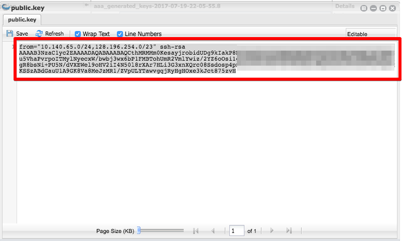
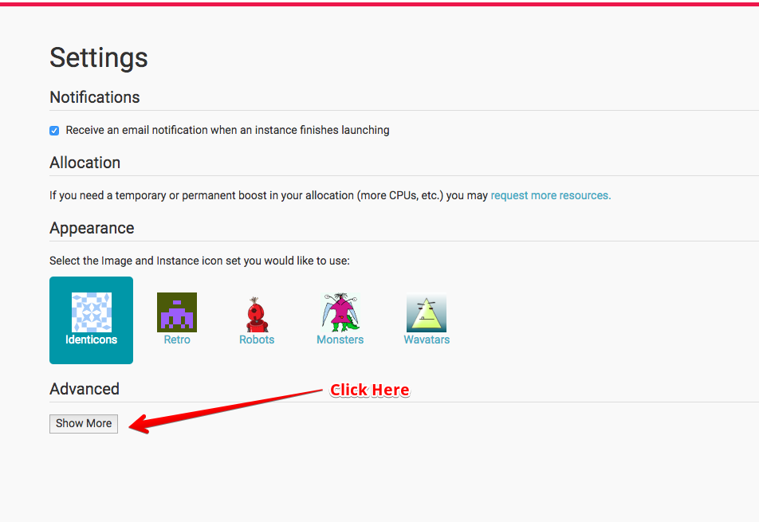
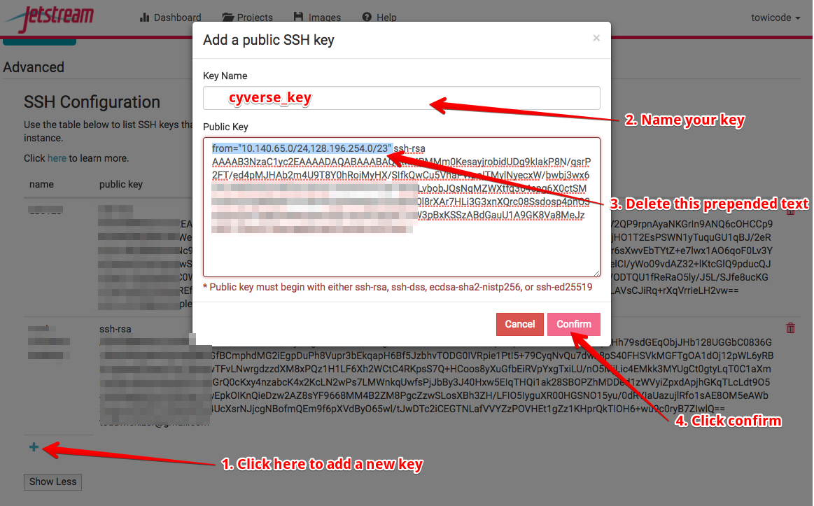

##########################
Uploading Key to Jetstream
##########################

In the discovery environment navigate to the generated key and open it in the built in editor.
You should be able to copy the output by selecting the entire text and pressing the copy key on your pc. cmd c or ctrl c.

With this in your pastebin, navigate to the jetstream site. Then select your user settings. You will need to click the advanced setting tab
to open up the ssh settings.

follow the directions below to add your key. 

1. Click the `+` button to add a new key. A window will pop up. 

2. Name the key something relevant. Ex. cyverse_key 

3. Paste the key into the bottom text box. 

4. Remove the prepended `from` text as show highlighted below. 

5. Click Submit  

